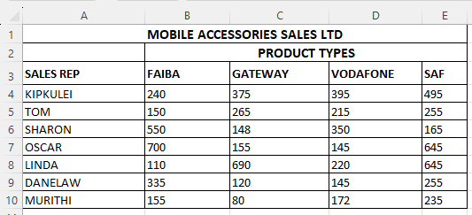

# Electronics Data Analysis

MASL is a company that engages in the sales of the following Mobile service providers: **Faiba**, **Gateway**, **Vodafone**, and **SAF**.  
The company uses representatives who operate in various regions in Nakuru town. Each sales representative presents monthly sales to the manager (Values are in **Ksh**).

  

---

## Task: Compute

### 1. For the total sales, average, highest and lowest sales for each product and each sales representative.

#### (a) Total Sales per Sales Representative

**Formula:**  
`=SUM(B4:E4)`  
> Copy the formula down for each sales rep.

---

#### (b) Total Sales per Product Type

**Formula:**  
- For **Faiba** (Column B): `=SUM(B4:B10)`
- For **Gateway** (Column C): `=SUM(C4:C10)`
- For **Vodafone** (Column D): `=SUM(D4:D10)`
- For **SAF** (Column E): `=SUM(E4:E10)`

---

#### (c) Average Sales per Sales Representative

**Formula:**  
`=AVERAGE(B4:E4)`  
> Copy the formula down for each sales rep.

---

#### (d) Average Sales per Product Type

**Formula:**  
- For **Faiba**: `=AVERAGE(B4:B10)`
- Similarly for other products.

---

#### (e) Highest and Lowest Sales per Product Type

**Highest Sales:**
- For **Faiba**: `=MAX(B4:B10)`
- For other products, adjust the formula accordingly.

**Lowest Sales:**
- For **Faiba**: `=MIN(B4:B10)`
- Repeat for other products.

---

### 2. Each salesperson earns Bonus points for the sales of each product type based on the following criteria; insert a column Bonuspoint and compute the points of each sales person.

| Condition | Points Awarded |
|-----------|----------------|
| Sales > 50 for Faiba | 1 point |
| Sales > 60 for Gateway | 2 points |
| Sales > 50 for Vodafone | 3 points |
| Sales > 60 for SAF | 2 points |

**Answer:**  
Insert a new column called **Bonuspoint** (Column H).

**Formula:**  
`=IF(B4>50,1,0) + IF(C4>60,2,0) + IF(D4>50,3,0) + IF(E4>60,2,0)`

> This formula checks each condition and sums the points accordingly.

---

### 3. Insert a blank column after Bonuspoint called Award and based on the Bonus points earned by each sales representative. Use a function to display the remarks on Awards as follows:

Award assignment rules:

| Total Sales | Award |
|-------------|-------|
| More than 2500 | Cash |
| More than 1000 and less than 2500 | Voucher |
| Less than 1000 | Try Again |

**Answer:**  
Insert a new column called **Award** (Column I).

**Formula:**  
`=IF(SUM(B4:E4)>2500,"cash",IF(SUM(B4:E4)>1000,"voucher","try again"))`

---

### 4. Apply border to the data in the workbook.

- Select the entire data table.
- Go to **Home > Borders > All Borders**.

---

### 5. Rotate up all the product type headings labels in the worksheet to 15 degrees.

- Select **Faiba**, **Gateway**, **Vodafone**, and **SAF** headers.
- Go to **Home > Alignment > Orientation > Rotate Text Up**.
- Set the custom angle to **15 degrees**.

---

### 6. Generate a column chart representing the total sales for each sales representative.

- Select the names and their corresponding total sales.
- Insert → Charts → Column Chart.

---

### 7. Copy the data above to sheet 2 and save it as a calculated sheet.

- Right-click on the sheet tab → **Move or Copy** → check **Create a copy** → move to a new sheet.
- Rename the new sheet to **Calculated Sheet**.

---
